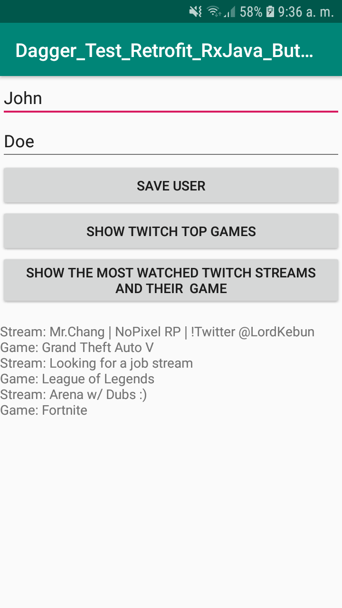

# Dagger_Test_Retrofit_RxJava_ButterKnife_Sample
Android app example using MVP Architecture, Dagger2, JUnit and Mockito test, RxJava2 and Butterknife

You can find a tag for each technology, and compare the evolution of the code between versions.

I use [TwichAPI](https://dev.twitch.tv/) to get data.

